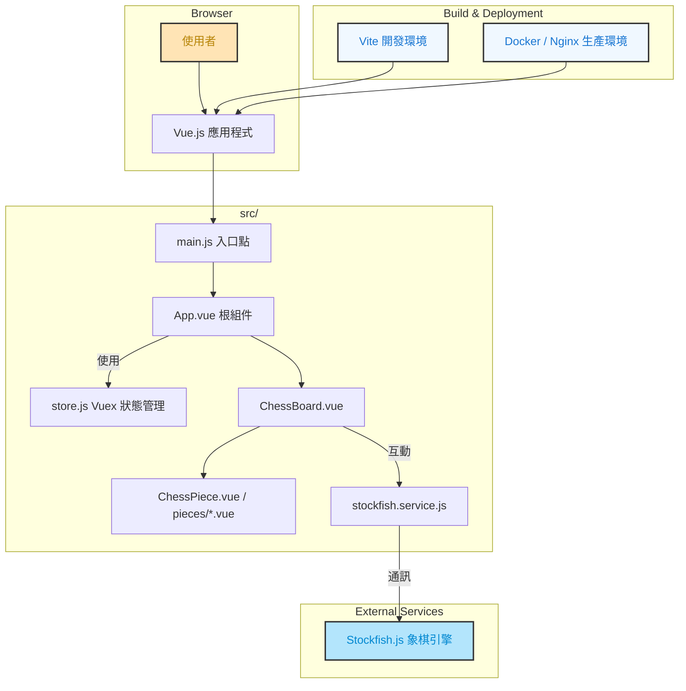
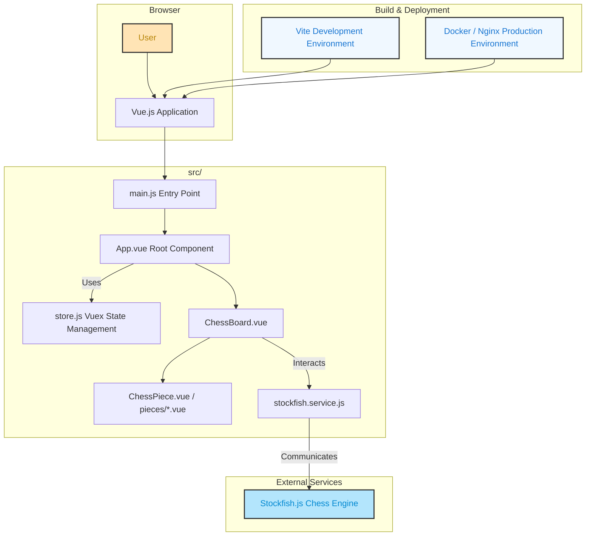

# Vue 國際象棋 | Chess in Vue

[繁體中文](#繁體中文) | [English](#english)

<a id="繁體中文"></a>
## 繁體中文

### 專案概述

Vue 國際象棋是一款使用 Vue 3 和 Vite 開發的網頁版國際象棋遊戲。此專案提供了一個美觀且直觀的使用者介面，讓玩家能夠與 AI 進行對戰，提升棋藝水平。

### 主要功能

- 完整實現國際象棋規則的遊戲系統
- 整合 Stockfish 國際象棋引擎提供 AI 對戰功能
- 直觀的棋子移動與提示系統
- 可行動位置高亮顯示
- 響應式設計，適合不同裝置使用
- 美觀的遊戲界面與動畫效果
- 支援 FEN 格式棋盤狀態生成

### 技術棧

- **前端框架**: Vue 3
- **狀態管理**: Vuex 4
- **構建工具**: Vite
- **HTTP 客戶端**: Axios
- **國際象棋引擎**: Stockfish.js
- **容器化**: Docker

### 專案架構



### 安裝與運行

#### 安裝依賴

```sh
npm install
```

#### 開發環境運行

```sh
npm run dev
```

#### 生產環境構建

```sh
npm run build
```

#### 使用 Docker 運行

```sh
docker-compose up -d
```

### 推薦的開發環境

- [VSCode](https://code.visualstudio.com/) + [Volar](https://marketplace.visualstudio.com/items?itemName=Vue.volar) (並停用 Vetur) + [TypeScript Vue Plugin (Volar)](https://marketplace.visualstudio.com/items?itemName=Vue.vscode-typescript-vue-plugin)

---

<a id="english"></a>
## English

### Project Overview

Chess in Vue is a web-based chess game developed with Vue 3 and Vite. This project provides a beautiful and intuitive user interface that allows players to compete against an AI opponent to improve their chess skills.

### Key Features

- Complete implementation of chess rules
- Integration with Stockfish chess engine for AI gameplay
- Intuitive piece movement and hint system
- Valid move highlighting
- Responsive design for various devices
- Beautiful game interface with animations
- Support for FEN format board state generation

### Tech Stack

- **Frontend Framework**: Vue 3
- **State Management**: Vuex 4
- **Build Tool**: Vite
- **HTTP Client**: Axios
- **Chess Engine**: Stockfish.js
- **Containerization**: Docker

### Project Structure



### Installation and Running

#### Install Dependencies

```sh
npm install
```

#### Run Development Server

```sh
npm run dev
```

#### Build for Production

```sh
npm run build
```

#### Run with Docker

```sh
docker-compose up -d
```

### Recommended IDE Setup

[VSCode](https://code.visualstudio.com/) + [Volar](https://marketplace.visualstudio.com/items?itemName=Vue.volar) (and disable Vetur) + [TypeScript Vue Plugin (Volar)](https://marketplace.visualstudio.com/items?itemName=Vue.vscode-typescript-vue-plugin)
